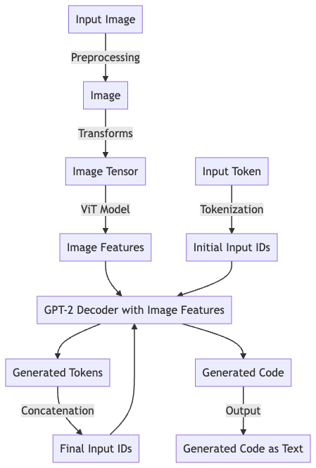

# Image to DSL Model using ViT and Transformer Decoder

This repository contains the implementation of an Image to DSL (Domain Specific Language) model. The model uses a pre-trained Vision Transformer (ViT) as an encoder to extract image features and a custom Transformer Decoder to generate DSL code from the extracted features.



## Overview

1. The ViT model is used to encode input images (screenshot of a user interface) into a sequence of feature vectors.
2. The custom Transformer Decoder is trained to generate a sequence of DSL tokens corresponding to the input image's structure.

## Requirements

- Python 3.6 or higher
- PyTorch 1.8 or higher
- torchvision
- transformers
- PIL (Python Imaging Library)

## Installation

Install the required packages:

```bash
pip install -r requirements.txt
```

## Dataset

down the dataset by running the `get_data.sh` script:

```
bash get_data.sh
```

## Training

To train the model, simply run the `train.py` script:
The training script will train the model for the specified number of epochs and save the best model weights in the current directory as `best_decoder.pth`.

## Inference

To generate DSL code from an input image, run `generate.py` script. The script will load the best model weights and generate DSL code for the input image.

## Server as an API with integration of Chatbot GPT

To start the server, execute the `app.py` script. This script will load the optimal model weights and initiate a server on port 8080. The server provides a single endpoint `/generate_code`, which accepts an image and an OpenAI API key as input, and returns the generated HTML code.

## Model Architecture

The Image to DSL model consists of the following components:

- Input Image: An image of a web UI that serves as input to the model.
- Preprocessing: The input image is preprocessed to prepare it for the ViT model.
- ViT Model: A pretrained Vision Transformer model is used to extract features from the preprocessed input image.
- GPT-2 Pre-trained Decoder: A pre-trained Transformer decoder takes image features and generates the corresponding DSL tokens.
- Output Tokens: The generated tokens are passed through a linear layer to produce the final output tokens.
- Predicted DSL Code: The output tokens are decoded back into the DSL code.
